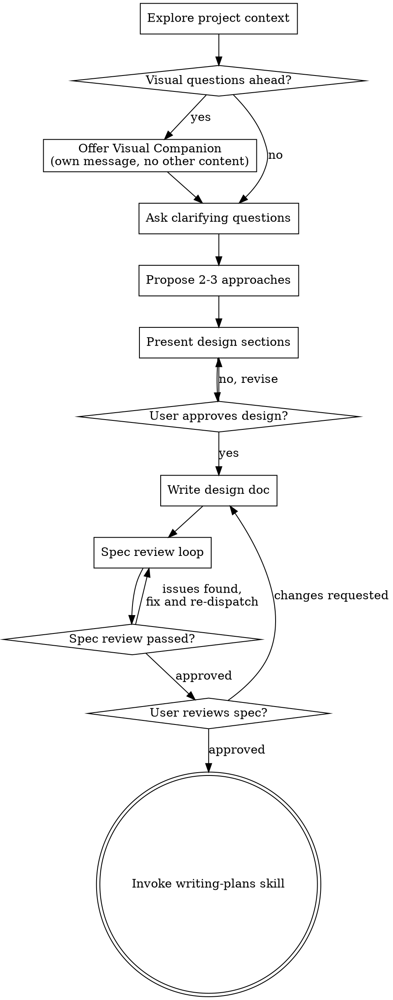

# Claude Conversation Log

Session ID: 3ca821b9-079d-42d5-965d-f4081bdc766d
Date: 2026-03-22 07:30:15

---

## 👤 User

Brainstorming with me:

This is an inventory system for a camera repair shop. The main goals are:

1. Store and track repair data for each item received, including: received date, serial number,
   status (ice box / not started / in progress / testing / done), owner, cost, repair logs,
   and delivery date.
   - Item categories: cameras, lenses, accessories, miscellaneous

2. File-based architecture, not SaaS. The preference is for a file-based project with dedicated
   scripts that maintain system state.
   - Directory structure: data/ for raw input, structured/ for system-processed data, docs/ for
     human- and agent-readable documentation.
   - The shop uses a dedicated HTML page backed by a shell script to create and update inventory
     records.
   - A separate HTML dashboard — also backed by a shell script — lets the shop track repair
     progress, identify who to contact, and mark undelivered items as delivered.
   - "File-based" doesn't mean no database at all. SQLite is welcome if there's a clear need.
     The intent is for the system to serve as the authoritative data store — something that can
     grow with future requirements without being locked behind an abstraction layer.

3. UI language: Traditional Chinese.

---

## 👤 User

Base directory for this skill: /Users/saiday/.claude/plugins/cache/claude-plugins-official/superpowers/5.0.5/skills/brainstorming

# Brainstorming Ideas Into Designs

Help turn ideas into fully formed designs and specs through natural collaborative dialogue.

Start by understanding the current project context, then ask questions one at a time to refine the idea. Once you understand what you're building, present the design and get user approval.

<HARD-GATE>
Do NOT invoke any implementation skill, write any code, scaffold any project, or take any implementation action until you have presented a design and the user has approved it. This applies to EVERY project regardless of perceived simplicity.
</HARD-GATE>

## Anti-Pattern: "This Is Too Simple To Need A Design"

Every project goes through this process. A todo list, a single-function utility, a config change — all of them. "Simple" projects are where unexamined assumptions cause the most wasted work. The design can be short (a few sentences for truly simple projects), but you MUST present it and get approval.

## Checklist

You MUST create a task for each of these items and complete them in order:

1. **Explore project context** — check files, docs, recent commits
2. **Offer visual companion** (if topic will involve visual questions) — this is its own message, not combined with a clarifying question. See the Visual Companion section below.
3. **Ask clarifying questions** — one at a time, understand purpose/constraints/success criteria
4. **Propose 2-3 approaches** — with trade-offs and your recommendation
5. **Present design** — in sections scaled to their complexity, get user approval after each section
6. **Write design doc** — save to `docs/superpowers/specs/YYYY-MM-DD-<topic>-design.md` and commit
7. **Spec review loop** — dispatch spec-document-reviewer subagent with precisely crafted review context (never your session history); fix issues and re-dispatch until approved (max 3 iterations, then surface to human)
8. **User reviews written spec** — ask user to review the spec file before proceeding
9. **Transition to implementation** — invoke writing-plans skill to create implementation plan

## Process Flow



**The terminal state is invoking writing-plans.** Do NOT invoke frontend-design, mcp-builder, or any other implementation skill. The ONLY skill you invoke after brainstorming is writing-plans.

## The Process

**Understanding the idea:**

- Check out the current project state first (files, docs, recent commits)
- Before asking detailed questions, assess scope: if the request describes multiple independent subsystems (e.g., "build a platform with chat, file storage, billing, and analytics"), flag this immediately. Don't spend questions refining details of a project that needs to be decomposed first.
- If the project is too large for a single spec, help the user decompose into sub-projects: what are the independent pieces, how do they relate, what order should they be built? Then brainstorm the first sub-project through the normal design flow. Each sub-project gets its own spec → plan → implementation cycle.
- For appropriately-scoped projects, ask questions one at a time to refine the idea
- Prefer multiple choice questions when possible, but open-ended is fine too
- Only one question per message - if a topic needs more exploration, break it into multiple questions
- Focus on understanding: purpose, constraints, success criteria

**Exploring approaches:**

- Propose 2-3 different approaches with trade-offs
- Present options conversationally with your recommendation and reasoning
- Lead with your recommended option and explain why

**Presenting the design:**

- Once you believe you understand what you're building, present the design
- Scale each section to its complexity: a few sentences if straightforward, up to 200-300 words if nuanced
- Ask after each section whether it looks right so far
- Cover: architecture, components, data flow, error handling, testing
- Be ready to go back and clarify if something doesn't make sense

**Design for isolation and clarity:**

- Break the system into smaller units that each have one clear purpose, communicate through well-defined interfaces, and can be understood and tested independently
- For each unit, you should be able to answer: what does it do, how do you use it, and what does it depend on?
- Can someone understand what a unit does without reading its internals? Can you change the internals without breaking consumers? If not, the boundaries need work.
- Smaller, well-bounded units are also easier for you to work with - you reason better about code you can hold in context at once, and your edits are more reliable when files are focused. When a file grows large, that's often a signal that it's doing too much.

**Working in existing codebases:**

- Explore the current structure before proposing changes. Follow existing patterns.
- Where existing code has problems that affect the work (e.g., a file that's grown too large, unclear boundaries, tangled responsibilities), include targeted improvements as part of the design - the way a good developer improves code they're working in.
- Don't propose unrelated refactoring. Stay focused on what serves the current goal.

## After the Design

**Documentation:**

- Write the validated design (spec) to `docs/superpowers/specs/YYYY-MM-DD-<topic>-design.md`
  - (User preferences for spec location override this default)
- Use elements-of-style:writing-clearly-and-concisely skill if available
- Commit the design document to git

**Spec Review Loop:**
After writing the spec document:

1. Dispatch spec-document-reviewer subagent (see spec-document-reviewer-prompt.md)
2. If Issues Found: fix, re-dispatch, repeat until Approved
3. If loop exceeds 3 iterations, surface to human for guidance

**User Review Gate:**
After the spec review loop passes, ask the user to review the written spec before proceeding:

> "Spec written and committed to `<path>`. Please review it and let me know if you want to make any changes before we start writing out the implementation plan."

Wait for the user's response. If they request changes, make them and re-run the spec review loop. Only proceed once the user approves.

**Implementation:**

- Invoke the writing-plans skill to create a detailed implementation plan
- Do NOT invoke any other skill. writing-plans is the next step.

## Key Principles

- **One question at a time** - Don't overwhelm with multiple questions
- **Multiple choice preferred** - Easier to answer than open-ended when possible
- **YAGNI ruthlessly** - Remove unnecessary features from all designs
- **Explore alternatives** - Always propose 2-3 approaches before settling
- **Incremental validation** - Present design, get approval before moving on
- **Be flexible** - Go back and clarify when something doesn't make sense

## Visual Companion

A browser-based companion for showing mockups, diagrams, and visual options during brainstorming. Available as a tool — not a mode. Accepting the companion means it's available for questions that benefit from visual treatment; it does NOT mean every question goes through the browser.

**Offering the companion:** When you anticipate that upcoming questions will involve visual content (mockups, layouts, diagrams), offer it once for consent:
> "Some of what we're working on might be easier to explain if I can show it to you in a web browser. I can put together mockups, diagrams, comparisons, and other visuals as we go. This feature is still new and can be token-intensive. Want to try it? (Requires opening a local URL)"

**This offer MUST be its own message.** Do not combine it with clarifying questions, context summaries, or any other content. The message should contain ONLY the offer above and nothing else. Wait for the user's response before continuing. If they decline, proceed with text-only brainstorming.

**Per-question decision:** Even after the user accepts, decide FOR EACH QUESTION whether to use the browser or the terminal. The test: **would the user understand this better by seeing it than reading it?**

- **Use the browser** for content that IS visual — mockups, wireframes, layout comparisons, architecture diagrams, side-by-side visual designs
- **Use the terminal** for content that is text — requirements questions, conceptual choices, tradeoff lists, A/B/C/D text options, scope decisions

A question about a UI topic is not automatically a visual question. "What does personality mean in this context?" is a conceptual question — use the terminal. "Which wizard layout works better?" is a visual question — use the browser.

If they agree to the companion, read the detailed guide before proceeding:
`skills/brainstorming/visual-companion.md`


---

## 🤖 Claude

Fresh repo — no files, no commits. Good, we're starting from scratch.

---

## 🤖 Claude

Some of what we're working on might be easier to explain if I can show it to you in a web browser. I can put together mockups, diagrams, comparisons, and other visuals as we go. This feature is still new and can be token-intensive. Want to try it? (Requires opening a local URL)

---

## 👤 User

yes, proceed.

Addition: the repair logs in 1. prefer to be a folder that can contains any files

---

## 🤖 Claude

Visual companion is running. Open **http://localhost:64879** in your browser.

Good note on repair logs — so each repair item gets its own folder where the shop can drop in any files (photos of damage, receipts, notes, etc.). Makes sense for a physical repair shop.

Let me start with the first clarifying question. This is about how the two HTML interfaces relate to the shell scripts:

When you say "backed by a shell script," are you picturing:

**(A)** The shell script generates static HTML files from the data (run script → produces an updated `.html` file you open in the browser)

**(B)** The shell script runs a lightweight local web server (e.g. Python's `http.server` or similar) that serves the HTML and handles form submissions

**(C)** Something else — describe what you have in mind

---

## 👤 User

A and B combined

---

## 🤖 Claude

Got it — shell scripts generate the HTML from data, and a local server handles serving pages and receiving form submissions. Clean approach.

Next question: How does the shop currently track repairs? Are they coming from paper/spreadsheets, or is this greenfield with no existing data to migrate?

---

## 👤 User

Currently uses google sheets

---

## 🤖 Claude

Understood. So there may be existing data to consider for initial import, but the system itself is greenfield.

Next question: How many concurrent repair items does the shop typically handle at any given time? This affects whether we need pagination, search, or if a single-page list is sufficient.

**(A)** Small — under 30 items at a time
**(B)** Medium — 30 to 100
**(C)** Large — 100+

---

## 👤 User

A

---

## 🤖 Claude

Good — a single-page list without pagination will work fine.

Next question: For the "owner" field on each repair item, what does that represent?

**(A)** The customer who brought the item in (contact info for pickup notification)
**(B)** The technician assigned to the repair
**(C)** Both — track the customer and the assigned technician separately

---

## 👤 User

I'd like to amend my previous answer: will be C if you're asking for inventory

For current question:
A

---

## 🤖 Claude

Got it — active repairs are small (under 30), but total inventory history could grow to 100+. So the dashboard showing active items can be a simple list, but we'll want to keep historical records queryable (this is where SQLite earns its keep).

And owner = the customer (for contact/pickup purposes).

Next question: When a repair is marked "done" and the customer is contacted, what happens next?

**(A)** The item stays visible on the dashboard until explicitly marked "delivered" (picked up), then it disappears from the active view
**(B)** "Done" is the final status — no separate delivery tracking needed
**(C)** Something else

---

## 👤 User

A

---

## 🤖 Claude

Clear. So the lifecycle is: received → ice box/not started → in progress → testing → done → delivered (archived from active view).

Next question: For the customer/owner info, what fields do you need?

**(A)** Just a name (enough to identify who to call)
**(B)** Name + phone number
**(C)** Name + phone + additional fields (email, address, LINE ID, etc.)

---

## 👤 User

> the lifecycle is: received → ice box/not started → in progress → testing → done → delivered

Almost right, should be: received → not started → in progress → testing → done → delivered; ice box is an intentionally state

For current question:
B but not limited to phone number, it could be Instagram/Facebook ID. Just leave it a simple text field is good enough

---

## 🤖 Claude

Got it — two corrections noted:

1. **Lifecycle**: received → not started → in progress → testing → done → delivered. "Ice box" is a separate, intentional state (parked/on hold), not part of the normal flow.
2. **Customer contact**: Name + a free-text contact field (phone, IG, FB, whatever they provide).

Next question: For the cost field on each repair, what does it track?

**(A)** Just the quoted/final price to the customer
**(B)** Cost of parts + labor breakdown
**(C)** Multiple cost entries over time (e.g. initial estimate, then revised, then final)

---

## 👤 User

C but keep it simple

---

## 🤖 Claude

Got it — a simple list of cost entries with amounts and notes, not a formal accounting structure. Enough to see "estimated 3000 → parts arrived, revised to 4500 → final 4200" kind of history.

Next question: For the entry page (creating/updating records), who will be using it?

**(A)** Just the shop owner / one person
**(B)** Multiple staff members, but no need for user accounts or permissions
**(C)** Multiple staff with distinct roles/permissions

---

## 👤 User

A

---

## 🤖 Claude

Simple — single user, no auth needed.

Last question: For the Google Sheets migration, do you want the system to include a one-time import script, or is that out of scope for now (you'd enter items manually)?

**(A)** Include an import script — I can export a CSV from Sheets
**(B)** Out of scope — I'll start fresh

---

## 👤 User

B

---

## 🤖 Claude

Good, clean starting point. I have a clear picture now. Let me propose approaches.

## Three Approaches

**Approach A: Pure flat-file (JSON/YAML + shell scripts)**
- Each repair item is a directory under `data/` containing a metadata JSON file and the repair log files
- Shell scripts read/write these files directly, generate static HTML
- A simple Python/Node HTTP server handles form submissions by updating the JSON files

Pros: Dead simple, fully transparent, `grep`-able, version-controllable with git
Cons: No querying power — filtering by status, date ranges, or searching across items requires custom scripting for every query. Gets painful as history grows past a few hundred items.

**Approach B: SQLite + file system hybrid (recommended)**
- SQLite database stores structured data (items, customers, cost entries, status history)
- Each repair item still gets a directory under `data/repairs/<item-id>/` for its log files (photos, notes, arbitrary files)
- Shell scripts orchestrate: generate HTML from SQLite queries, serve via lightweight Python HTTP server, handle form submissions by writing to SQLite
- The database file lives in `data/inventory.db` — portable, backupable, single file

Pros: Real querying (filter by status, date range, customer), history grows gracefully, still file-based and portable, SQLite is zero-config
Cons: Slightly more setup than pure flat-files, data not directly `grep`-able (but `sqlite3` CLI is excellent)

**Approach C: Full flat-file with an index**
- Like A, but maintain a generated index file (or SQLite as a read cache) that gets rebuilt from flat files
- Flat files remain the source of truth; the index is derived

Pros: Best of both worlds in theory
Cons: Keeping the index in sync adds complexity that SQLite already solves natively. Over-engineered for this scale.

---

**My recommendation: Approach B.** You mentioned SQLite is welcome, and it's the natural fit here. You get queryable structured data where it matters (status tracking, filtering, history) and a plain file system where it matters (repair log folders with arbitrary files). The `inventory.db` file is just as portable and backupable as JSON files, but far more capable as the shop's history grows.

What do you think?

---

## 👤 User

Option A, but with a predefined Markdown structure. The file is generated and parsed programmatically via commands. If parsing fails, the system throws an error, easy and informative.

---

## 🤖 Claude

Nice — structured Markdown as the source of truth. Human-readable, git-diffable, and parseable with clear error messages when the format is wrong. I like it.

Let me present the design section by section. Starting with the data model.

---

## Section 1: Data Model & File Structure

Each repair item is a **directory** containing a structured Markdown file and a `logs/` folder for arbitrary attachments.

```
data/
  repairs/
    RPR-20260322-001/
      item.md          # structured Markdown — the source of truth
      logs/            # arbitrary files: photos, receipts, notes, etc.
        damage-photo.jpg
        vendor-quote.pdf
```

**Item ID format**: `RPR-YYYYMMDD-NNN` (date received + daily sequence number). Simple, sortable, no collisions.

**`item.md` structure** — YAML frontmatter for machine-parseable fields, Markdown body for cost history:

```markdown
---
id: RPR-20260322-001
category: camera
brand: Canon
model: EOS R5
serial_number: "012345678"
status: in_progress
owner_name: 王小明
owner_contact: 0912-345-678
cost_currency: TWD
received_date: 2026-03-22
delivered_date:
---

# 維修描述

觀景窗有霧氣，快門異音

# 費用紀錄

| 日期 | 金額 | 說明 |
|------|------|------|
| 2026-03-22 | 3000 | 初步估價 |
| 2026-03-25 | 4500 | 需更換快門組件 |
```

- **Frontmatter** (between `---`): strictly validated fields. Parse error = immediate, clear error message saying which field is wrong.
- **Body sections** (`# 維修描述`, `# 費用紀錄`): parsed by heading name. Missing or extra sections trigger errors.
- **`logs/` folder**: not parsed — just a bucket for any files the shop drops in.
- **Categories**: `camera`, `lens`, `accessory`, `misc`
- **Statuses**: `received`, `not_started`, `in_progress`, `testing`, `done`, `delivered`, `ice_box`

Does this structure look right before I move to the next section?

---

## 👤 User

>  Item ID format: RPR-YYYYMMDD-NNN (date received + daily sequence number). Simple, sortable, no collisions.

Since all cameras and accessories have model names — which matter for human readability —
the preferred ID format is: CAM-YYYYMMDD-MODEL-NNN

- CAM is the item type prefix, one of: CAM (Camera), LENS (Lens), ACCE (Accessory), OTH (Other)
- MODEL is the model name, entered manually by the shop
- NNN is a zero-padded daily sequence number

---

## 🤖 Claude

Good call — much more scannable at a glance. `LENS-20260322-SEL2470GM-001` tells you what it is without opening the file.

Updated data model:

```
data/
  repairs/
    CAM-20260322-EOSR5-001/
      item.md
      logs/
    LENS-20260322-SEL2470GM-001/
      item.md
      logs/
```

**ID format**: `{TYPE}-{YYYYMMDD}-{MODEL}-{NNN}`
- Type prefixes: `CAM`, `LENS`, `ACCE`, `OTH`
- Model: manually entered, becomes part of the directory name
- NNN: zero-padded daily sequence (per type+date+model combination)

**Updated frontmatter** accordingly:

```markdown
---
id: CAM-20260322-EOSR5-001
category: camera
brand: Canon
model: EOS R5
serial_number: "012345678"
status: in_progress
owner_name: 王小明
owner_contact: 0912-345-678
cost_currency: TWD
received_date: 2026-03-22
delivered_date:
---

# 維修描述

觀景窗有霧氣，快門異音

# 費用紀錄

| 日期 | 金額 | 說明 |
|------|------|------|
| 2026-03-22 | 3000 | 初步估價 |
| 2026-03-25 | 4500 | 需更換快門組件 |
```

One clarification: should the MODEL portion in the ID strip spaces/special characters automatically (e.g. `EOS R5` → `EOSR5`, `SEL 24-70 GM` → `SEL2470GM`), or do you want the shop to type the short form directly?

---

## 👤 User

Correct, MODEL portion should strip spaces/special characters on saving.

Also, frontmatter's `cost_currency` is unneeded.

Proceed to next.

---

## 🤖 Claude

Noted — MODEL auto-strips spaces/special chars, `cost_currency` removed.

## Section 2: System Architecture & Scripts

The system has two main interfaces (entry page + dashboard), each backed by shell scripts, plus a shared local server.

**Directory layout:**

```
camera-repair-store-inventory/
  data/
    repairs/                   # repair item directories live here
  scripts/
    server.sh                  # starts the local Python HTTP server
    generate-entry.sh          # generates the entry/edit HTML page
    generate-dashboard.sh      # generates the dashboard HTML page
    create-item.sh             # creates a new repair item (dir + item.md)
    update-item.sh             # updates an existing item's frontmatter/body
    parse-item.sh              # shared: parses item.md, validates, errors clearly
  web/
    entry.html                 # generated: form for creating/editing items
    dashboard.html             # generated: status board + delivery tracking
    static/                    # CSS, JS assets
  docs/
    format.md                  # documents the item.md schema for humans & agents
```

**How it works:**

1. `server.sh` — starts a lightweight Python HTTP server (using `http.server` or Flask). Serves `web/` statically and handles form POST endpoints (`/api/create`, `/api/update`, `/api/deliver`).

2. **Form submission flow**: User fills form in browser → POST to server → server calls `create-item.sh` or `update-item.sh` → script writes/updates `item.md` → script calls `generate-dashboard.sh` to regenerate the dashboard HTML.

3. **Parse/validate**: `parse-item.sh` is the single source of truth for reading `item.md`. Every script that reads an item goes through it. If the Markdown structure is wrong, it prints a clear error: `"ERROR: item.md parse failed — missing required field 'serial_number' in CAM-20260322-EOSR5-001"`.

4. **Dashboard regeneration**: `generate-dashboard.sh` reads all `data/repairs/*/item.md` via `parse-item.sh`, groups by status, and writes `web/dashboard.html`. Called after every mutation, so the dashboard is always current.

**Key principle**: Shell scripts do the data work (parse, validate, create, update). Python server is a thin HTTP layer that calls shell scripts and serves HTML. The HTML pages are generated artifacts, not templates rendered at request time.

Does this architecture feel right?

---

## 👤 User

super!

---

## 🤖 Claude


## Section 3: Entry Page (建立/編輯維修單)

The entry page is a single HTML form for both creating new items and editing existing ones.

**Creating a new item** — user navigates to the entry page, fills in:
- Category (dropdown: 相機/鏡頭/配件/其他 — determines the type prefix)
- Brand (text)
- Model (text — auto-stripped for the ID)
- Serial number (text)
- Owner name (text)
- Owner contact (text)
- 維修描述 (textarea)
- Initial cost estimate (optional: amount + note)

On submit → `create-item.sh` generates the ID, creates the directory + `item.md` + `logs/`, sets status to `received`.

**Editing an existing item** — user selects an item (by ID or from a list), form pre-fills with current values. Editable fields:
- Status (dropdown with valid transitions)
- All the original fields (brand, model, serial, owner, contact, description)
- Add cost entry (amount + note — appends a row to the cost table)
- Delivered date (set when marking as delivered)

On submit → `update-item.sh` rewrites `item.md` with updated values.

**Status transitions** — no strict enforcement of order, but the dropdown shows contextual options. Any status can move to `ice_box` and back. `delivered` sets the `delivered_date` automatically.

**The `logs/` folder** is not managed through this form — the shop drops files into the directory directly via Finder/file manager. The dashboard will link to the folder for easy access.

Does this match what you had in mind?

---

## 👤 User

If we maintain an owner list (updated via a hook script on item changes), we could offer dropdown autocomplete when entering an existing owner's name or phone number. Sounds cool?

---

## 🤖 Claude

Love it. A lightweight owner registry that builds itself from usage — no separate "manage customers" UI needed.

**How it would work:**

- `data/owners.json` — a simple list of `{name, contact}` pairs, deduplicated
- A hook script (`scripts/update-owners.sh`) runs after every `create-item.sh` / `update-item.sh` — scans the owner fields and upserts into `owners.json`
- The entry page loads `owners.json` and provides autocomplete on the name and contact fields — type a few characters, matching owners appear, selecting one fills both fields

This keeps the owner list always in sync with actual data, zero maintenance.

Moving on.

---

## Section 4: Dashboard (維修進度看板)

The dashboard is the daily working view — see what's in the shop, who to contact, what to deliver.

I'll show this one in the browser. Open **http://localhost:64879** to see a wireframe mockup.

---

## 🤖 Claude

Check **http://localhost:64879** — showing two layout options for the dashboard:

- **A: Kanban Board** — columns per status, visual flow left to right
- **B: Grouped List** — single scrollable page, items grouped under status headings

Both show item ID, model, owner, and days since received. Take a look and let me know which feels right, or click to select.

---

## 👤 User

A for sure, but what happens when an item is clicked? Can we opens relative logs folder?

---

## 🤖 Claude

Since it's a local system on macOS, clicking a card can absolutely open the `logs/` folder in Finder. The server would handle a request like `/api/open-logs/CAM-20260322-EOSR5-001` and run `open data/repairs/CAM-20260322-EOSR5-001/logs/` under the hood.

But the card click could do more than just that. What do you prefer?

**(A)** Click opens the logs folder directly — that's the primary action, keep it simple
**(B)** Click opens a detail popup/panel showing all item info (description, cost history, dates), with a button to open the logs folder
**(C)** Click navigates to the entry page in edit mode for that item, with a button to open the logs folder

---

## 👤 User

C even better

---

## 🤖 Claude

Nice — click a card → entry page in edit mode with all fields pre-filled, plus a button to open the logs folder in Finder. One interface for both viewing and editing.

So the dashboard cards are essentially navigation into the entry page. The flow is:

- **Dashboard**: see the board → click a card → **Entry page** (edit mode): see details, update fields, open logs folder
- **Entry page** also accessible directly for creating new items

Let me move on.

---

## Section 5: Technology Choices

**Server**: Python with Flask (minimal). Handles:
- Serving static HTML/CSS/JS from `web/`
- POST endpoints that call shell scripts (`create-item.sh`, `update-item.sh`)
- `/api/open-logs/<id>` — runs `open` to launch Finder
- Started via `scripts/server.sh`

**Shell scripts**: Bash. Handle all data operations — parse, validate, create, update. The server is just a thin HTTP proxy to these scripts.

**Markdown parsing**: A small Python or shell utility (`parse-item.sh`) that reads YAML frontmatter and the structured body sections. Validates required fields and section headings, exits with clear error messages on failure.

**HTML generation**: `generate-entry.sh` and `generate-dashboard.sh` produce self-contained HTML files. They read item data via `parse-item.sh` and output to `web/`.

**Frontend**: Vanilla HTML/CSS/JS — no build step, no framework. The kanban board and entry form are straightforward enough that plain JS is fine.

**Language**: All UI text in Traditional Chinese. Script output and error messages in English (for the developer).

Does this stack work for you?

---

## 👤 User

Hmm, Python is great choice but I'm considering the dependencies managment for non-tech people. I suggest our server.sh handles dependencies installation as well as a dumb start.

---

## 🤖 Claude

Absolutely right — the shop owner shouldn't have to think about `pip install` or virtual environments.

`server.sh` should be a single command that handles everything:

```bash
./scripts/server.sh
# 1. Checks if Python 3 is available (macOS ships with it)
# 2. Creates a venv in .venv/ if it doesn't exist
# 3. Installs Flask into the venv if not already installed
# 4. Starts the server
```

First run: sets up everything. Subsequent runs: just starts. One script, zero prerequisites beyond macOS's built-in Python.

If anything fails (no Python 3, port in use, etc.), clear error message in the terminal telling the user what to do.

Does this cover your concern, or did you have something else in mind?

---

## 👤 User

super!

---

## 🤖 Claude


## Section 6: Summary of the Full Design

Let me put it all together.

**Data layer:**
- Each repair item = a directory under `data/repairs/{TYPE}-{YYYYMMDD}-{MODEL}-{NNN}/`
- `item.md` with YAML frontmatter (id, category, brand, model, serial_number, status, owner_name, owner_contact, received_date, delivered_date) + Markdown body sections (維修描述, 費用紀錄)
- `logs/` folder for arbitrary files
- `data/owners.json` — auto-maintained owner registry for autocomplete

**Scripts:**
- `server.sh` — one-command setup + start (venv, Flask, serve)
- `create-item.sh` — creates directory + item.md + logs/, sets status to `received`
- `update-item.sh` — rewrites item.md with updated values
- `parse-item.sh` — shared parser/validator, clear errors on malformed files
- `update-owners.sh` — hook that syncs owners.json after create/update
- `generate-entry.sh` — generates the entry/edit HTML page
- `generate-dashboard.sh` — generates the kanban dashboard HTML

**Server (Flask):**
- Serves `web/` statically
- POST endpoints: `/api/create`, `/api/update`, `/api/deliver`
- `/api/open-logs/<id>` — opens logs folder in Finder
- Calls shell scripts for all data operations

**Entry page (建立/編輯維修單):**
- Single form for create and edit modes
- Owner autocomplete from owners.json
- Status dropdown, cost entry append, all fields editable
- Edit mode includes "open logs folder" button

**Dashboard (維修進度看板):**
- Kanban columns: 未開始 → 進行中 → 測試中 → 完成(待取件)
- Ice box as separate collapsed section
- Cards show: item ID, model, owner, days since received
- Click card → navigate to entry page in edit mode

**UI language:** Traditional Chinese. Script/error output: English.

---

Everything look good? If so, I'll write up the formal spec document.

---

## 👤 User

Questions:
- How the owner find existing item on entry page?
- Convince me Flask is inevitable stack, do we really need it?

---

## 🤖 Claude

Two good challenges.

**1. Finding existing items on the entry page**

Right now the only path to edit mode is clicking a card on the dashboard. That's a gap — what if the shop owner has the item in hand and just wants to look it up?

I'd add a simple search/select bar at the top of the entry page. Type a few characters → filter matching items by ID, model, or owner name. Select one → form fills in edit mode. The data source is the same set of `item.md` files, loaded as a JSON list when the page opens. With under 30 active items, a client-side filter is more than enough.

**2. Do we really need Flask?**

You're right to push back. Let me reconsider what the server actually does:

- Serve static files from `web/`
- Handle 3-4 POST routes that call shell scripts
- One route to run `open` on a folder

That's it. Python's **built-in `http.server`** module can do all of this with a custom handler class — zero external dependencies. The routing is simple enough (a few `if path == "/api/create"` branches) that a framework isn't justified.

**Revised stack**: Pure Python standard library. No Flask, no pip, no venv. `server.sh` just runs `python3 scripts/server.py`. Works on any Mac out of the box.

Agree?

---

## 👤 User

agree!

---

## 🤖 Claude

Let me write the formal spec document incorporating everything we've agreed on.

---

## 🤖 Claude

Now let me dispatch the spec reviewer.

---

## 🤖 Claude

Spec review: **Approved**. No blocking issues. Three advisory recommendations worth addressing:

1. **`received` status on dashboard** — items created as `received` don't have a dashboard column. Should they appear under 未開始, or is `received` a transient state?
2. **`/api/items` response shape** — should it include body sections (description, costs) or just frontmatter?
3. **Sequence number collision** — how `create-item.sh` determines the next NNN (scan existing dirs).

These are all minor. My quick answers:

1. `received` items should show in the 未開始 column — they're effectively "not started yet". We could merge them into one status, or keep `received` as a distinct status that shares the column.
2. `/api/items` returns frontmatter fields only for the search/list. Full body content is loaded when editing a specific item.
3. `create-item.sh` scans `data/repairs/` for existing directories matching the same type+date+model prefix and increments.

Want me to fold these clarifications into the spec, or are you fine with them as implementation-time decisions?

---

## 👤 User

Feedbacks:
1. we shouldn't hae `received` state at the first place, the default state will be "not_started"
2. /api/items/ responses frontmatter is enough, agree
3. agree on create-item.sh scans existing directories

fold these clarifications into the spec, good supplement

---

## 🤖 Claude

Spec updated and committed to `docs/superpowers/specs/2026-03-22-camera-repair-inventory-design.md`. Changes made:

- Removed `received` status — default is now `not_started`
- `/api/items` explicitly returns frontmatter fields only
- Documented how `create-item.sh` determines sequence numbers by scanning existing directories

Please review the spec and let me know if you want any changes before we move on to the implementation plan.

---

## 👤 User

As a subagent review the spec with a fresh eyes, gather more feedbacks on spec completeness

---

## 👤 User

[Request interrupted by user]

---

## 👤 User

Ask a subagent review the spec with a fresh eyes, gather more feedbacks on spec completeness

---

## 🤖 Claude

Good review. Here are the 10 findings, grouped by impact:

### Must address (would block implementation)

1. **No navigation between pages** — How does the user get from dashboard to entry page and back? Need a nav bar or header links, and define which page is the landing page.

2. **"Days since received" goes stale** — Dashboard is only regenerated on data mutations, but day counts change daily. Fix: compute in client-side JS using `received_date` as a data attribute.

3. **Edit mode URL scheme undefined** — How is the item ID passed when clicking a dashboard card? Suggest `entry.html?id={ITEM_ID}`.

4. **No API for full item data** — `/api/items` returns frontmatter only, but edit mode needs body sections (description, costs). Need a `GET /api/item/<id>` endpoint returning the complete item.

5. **`generate-entry.sh` purpose unclear** — The entry page is a client-side app that fetches data via APIs. It doesn't need regeneration. Remove `generate-entry.sh`; `entry.html` is a static page.

### Should clarify (prevent confusion)

6. **Single-user assumption** — No concurrent write protection. Add a note that single-user operation is an accepted design choice.

7. **Owner dedup key** — Dedup on `name`, update contact to most recently seen value.

8. **Cost entry edit/delete** — Not supported in UI. Corrections require manual file editing (acceptable for MVP).

9. **Server port** — Pick a default (e.g. 8080), mention env var override.

10. **Model stripping rules** — Specify exactly: strip all non-alphanumeric ASCII, then uppercase.

---

Want me to fold all of these into the spec?

---

## 👤 User

1. Both HTML pages share a toolbar with two navigation entries.
2. Yes, compute client-side in JS using received_date as a data attribute.
3. Yes, deep link format: entry.html?id={ITEM_ID}
4. Or — do we even need to? Can we load the Markdown directly into the HTML,
   since Markdown is our source of truth?
5. Without generate-entry.sh, how do we handle both the initial creation flow
   and ongoing development of the entry page?
6. Add a note clarifying this is a single-user system.
7. Owner dedup key is the combination of name and phone number.
8. Shop can edit estimated cost in the UI (amount and reason), which auto-generates
   a cost change log entry appended to the footer of the item's item.md.
9. Use a fixed port 8787. If the port is already in use, kill the existing process.
10. For non-alphanumeric ASCII characters, preserve original casing —
    e.g., Nikon Zfc -> Nikon-Zfc.

---

## 🤖 Claude

Great feedback. Let me respond to the two open questions before updating the spec:

**Point 4 — Load Markdown directly:** Yes, this is cleaner. The server serves the raw `item.md` at something like `GET /api/item/<id>/raw`, and the entry page JS parses the YAML frontmatter + Markdown body directly. The format is well-defined enough that a small JS parser handles it. No need for a separate structured API endpoint — the Markdown *is* the API.

**Point 5 — Without `generate-entry.sh`:** `entry.html` is a regular hand-written HTML file, like any web page. It loads data dynamically via JS (fetch items list, fetch raw Markdown for edit). No generation is needed because its structure doesn't change with data — only the dashboard needs regeneration because its *content* changes. During development, you just edit `entry.html` directly. We remove `generate-entry.sh` from the spec.

**Point 10 — Model stripping clarified:** Spaces become dashes, other non-alphanumeric characters removed, case preserved. So:
- `EOS R5` → `EOS-R5`
- `SEL 24-70 GM` → `SEL-24-70-GM`
- `Nikon Zfc` → `Nikon-Zfc`

Does this all track? If so I'll update the spec.

---

## 👤 User

agree on all

---

## 🤖 Claude

Now I'll apply all 10 changes:

---

## 🤖 Claude

Now update the example in the item.md structure to reflect the new ID format:

---

## 🤖 Claude

Spec updated and committed. All 10 review items addressed. Please take a look at the spec and let me know if anything else needs changing before we move to writing the implementation plan.

---

## 👤 User

proceed to implementation plan

---

## 👤 User

Base directory for this skill: /Users/saiday/.claude/plugins/cache/claude-plugins-official/superpowers/5.0.5/skills/writing-plans

# Writing Plans

## Overview

Write comprehensive implementation plans assuming the engineer has zero context for our codebase and questionable taste. Document everything they need to know: which files to touch for each task, code, testing, docs they might need to check, how to test it. Give them the whole plan as bite-sized tasks. DRY. YAGNI. TDD. Frequent commits.

Assume they are a skilled developer, but know almost nothing about our toolset or problem domain. Assume they don't know good test design very well.

**Announce at start:** "I'm using the writing-plans skill to create the implementation plan."

**Context:** This should be run in a dedicated worktree (created by brainstorming skill).

**Save plans to:** `docs/superpowers/plans/YYYY-MM-DD-<feature-name>.md`
- (User preferences for plan location override this default)

## Scope Check

If the spec covers multiple independent subsystems, it should have been broken into sub-project specs during brainstorming. If it wasn't, suggest breaking this into separate plans — one per subsystem. Each plan should produce working, testable software on its own.

## File Structure

Before defining tasks, map out which files will be created or modified and what each one is responsible for. This is where decomposition decisions get locked in.

- Design units with clear boundaries and well-defined interfaces. Each file should have one clear responsibility.
- You reason best about code you can hold in context at once, and your edits are more reliable when files are focused. Prefer smaller, focused files over large ones that do too much.
- Files that change together should live together. Split by responsibility, not by technical layer.
- In existing codebases, follow established patterns. If the codebase uses large files, don't unilaterally restructure - but if a file you're modifying has grown unwieldy, including a split in the plan is reasonable.

This structure informs the task decomposition. Each task should produce self-contained changes that make sense independently.

## Bite-Sized Task Granularity

**Each step is one action (2-5 minutes):**
- "Write the failing test" - step
- "Run it to make sure it fails" - step
- "Implement the minimal code to make the test pass" - step
- "Run the tests and make sure they pass" - step
- "Commit" - step

## Plan Document Header

**Every plan MUST start with this header:**

```markdown
# [Feature Name] Implementation Plan

> **For agentic workers:** REQUIRED SUB-SKILL: Use superpowers:subagent-driven-development (recommended) or superpowers:executing-plans to implement this plan task-by-task. Steps use checkbox (`- [ ]`) syntax for tracking.

**Goal:** [One sentence describing what this builds]

**Architecture:** [2-3 sentences about approach]

**Tech Stack:** [Key technologies/libraries]

---
```

## Task Structure

````markdown
### Task N: [Component Name]

**Files:**
- Create: `exact/path/to/file.py`
- Modify: `exact/path/to/existing.py:123-145`
- Test: `tests/exact/path/to/test.py`

- [ ] **Step 1: Write the failing test**

```python
def test_specific_behavior():
    result = function(input)
    assert result == expected
```

- [ ] **Step 2: Run test to verify it fails**

Run: `pytest tests/path/test.py::test_name -v`
Expected: FAIL with "function not defined"

- [ ] **Step 3: Write minimal implementation**

```python
def function(input):
    return expected
```

- [ ] **Step 4: Run test to verify it passes**

Run: `pytest tests/path/test.py::test_name -v`
Expected: PASS

- [ ] **Step 5: Commit**

```bash
git add tests/path/test.py src/path/file.py
git commit -m "feat: add specific feature"
```
````

## Remember
- Exact file paths always
- Complete code in plan (not "add validation")
- Exact commands with expected output
- Reference relevant skills with @ syntax
- DRY, YAGNI, TDD, frequent commits

## Plan Review Loop

After writing the complete plan:

1. Dispatch a single plan-document-reviewer subagent (see plan-document-reviewer-prompt.md) with precisely crafted review context — never your session history. This keeps the reviewer focused on the plan, not your thought process.
   - Provide: path to the plan document, path to spec document
2. If ❌ Issues Found: fix the issues, re-dispatch reviewer for the whole plan
3. If ✅ Approved: proceed to execution handoff

**Review loop guidance:**
- Same agent that wrote the plan fixes it (preserves context)
- If loop exceeds 3 iterations, surface to human for guidance
- Reviewers are advisory — explain disagreements if you believe feedback is incorrect

## Execution Handoff

After saving the plan, offer execution choice:

**"Plan complete and saved to `docs/superpowers/plans/<filename>.md`. Two execution options:**

**1. Subagent-Driven (recommended)** - I dispatch a fresh subagent per task, review between tasks, fast iteration

**2. Inline Execution** - Execute tasks in this session using executing-plans, batch execution with checkpoints

**Which approach?"**

**If Subagent-Driven chosen:**
- **REQUIRED SUB-SKILL:** Use superpowers:subagent-driven-development
- Fresh subagent per task + two-stage review

**If Inline Execution chosen:**
- **REQUIRED SUB-SKILL:** Use superpowers:executing-plans
- Batch execution with checkpoints for review


---

## 🤖 Claude


I'm using the writing-plans skill to create the implementation plan.

Let me re-read the final spec and plan out the file structure and tasks.

---

## 🤖 Claude

Now let me run the plan reviewer.

---

## 🤖 Claude

Plan review: **Approved**. No blocking issues. Some good advisory notes:

1. **Heredoc quoting in create-item.sh** — should quote the delimiter to prevent shell variable interpolation in user input
2. **Cost append assumes table is last** — fine for our format, noted as assumption
3. **style.css is prose-only** — implementer has freedom but less guidance
4. **JSON grep/sed parsing fragility** — acceptable for expected data
5. **Missing date fallback in server.py** — JS always sends it, but API-direct calls could break
6. **entry.html element IDs** — 16 IDs referenced in entry.js need to match

These are all valid. I'll fix the heredoc quoting issue (#1) and the date fallback (#5) since those could cause real bugs:

---

## 🤖 Claude

Let me clean up the visual companion server.

---

## 🤖 Claude

Plan complete and saved to `docs/superpowers/plans/2026-03-22-camera-repair-inventory.md`. Two execution options:

**1. Subagent-Driven (recommended)** — I dispatch a fresh subagent per task, review between tasks, fast iteration

**2. Inline Execution** — Execute tasks in this session using executing-plans, batch execution with checkpoints

Which approach?

---

## 👤 User

ask a subagent to review the implementation plan with a fresh eyes. the standard will be a sonnet model can easily follow and understand.

---

## 🤖 Claude

Excellent review. Here are the findings, ranked by severity:

### Must fix (would cause real failures)

1. **Bash 4+ features on macOS** — `declare -A` (associative arrays) and `local -n` (namerefs) require bash 4.3+, but macOS ships with bash 3.2. Scripts will crash on stock macOS. Need to rewrite using POSIX-compatible constructs or require Homebrew bash.

2. **entry.html has no code, only prose** — entry.js references 16+ specific element IDs. A Sonnet model will invent different names and the page won't work. Must provide complete HTML or at minimum an explicit ID contract table.

3. **style.css has no code, only prose** — Dashboard generator and entry.js use ~20 specific CSS class names. Must list them or provide the CSS.

4. **Frontmatter parser: empty value bug** — `delivered_date:` (no value) gets parsed as `"delivered_date:"` instead of empty string.

5. **Frontmatter parser: body extraction bug** — `sed` matches the first `---` not the second, so body_content includes frontmatter. Tests pass by accident.

### Should fix (design clarity)

6. **Hook calling divergence** — Spec says shell scripts call hooks, but plan puts hooks in server.py only. CLI usage won't update owners or dashboard. Should be explicit about this design choice.

7. **sed delimiter collision** — `update-item.sh` uses `|` as sed delimiter, which breaks if field values contain `|`.

8. **Server test fragility** — `sleep 1` for startup is unreliable.

---

These are serious enough to fix before handing to a Sonnet. Let me update the plan.

---

## 🤖 Claude

The plan is quite long. Rather than making dozens of inline edits, let me rewrite the affected sections. Let me read the rest of the plan to understand the full scope.

---

## 🤖 Claude

Now I have a complete picture. Let me make the targeted fixes. The main changes are:

1. **Bash compatibility** — rewrite `declare -A` and `local -n` to use Python for parsing/JSON instead
2. **Provide complete entry.html** with all element IDs
3. **Provide concrete style.css** with all class names
4. **Fix parse-item.sh** empty value and body extraction bugs
5. **Fix update-item.sh** sed delimiter
6. **Add note about hook calling design**

This is a significant rewrite of several tasks. Let me do it systematically.

---

## 🤖 Claude

Now fix parse-item.sh — rewrite to use Python instead of bash associative arrays:

---

## 🤖 Claude

Now fix create-item.sh to avoid `${!var}` indirect expansion:

---

## 🤖 Claude

Now fix update-item.sh sed delimiter:

---

## 🤖 Claude

Now fix update-owners.sh to avoid `declare -A`:

---

## 🤖 Claude

Now fix generate-dashboard.sh to avoid `declare -a`, `declare -A`, and `local -n`:

---

## 🤖 Claude

Now provide the complete entry.html with all element IDs:

---

## 🤖 Claude

Now provide concrete style.css with all class names:

---

## 🤖 Claude

Now fix the server test startup to be more robust:

---

## 🤖 Claude

Now commit the updated plan:

---

## 🤖 Claude

All review issues addressed:

1. **Bash 3.2 compatibility** — rewrote `parse-item.sh`, `update-owners.sh`, and `generate-dashboard.sh` to use inline Python for data structures. Removed all `declare -A`, `local -n`, and `${!var}`.
2. **Complete entry.html** — full HTML with element ID contract table (17 IDs explicitly documented)
3. **Complete style.css** — concrete CSS with all class names listed in a contract comment
4. **Parser bugs fixed** — Python-based parser handles empty values and body extraction correctly
5. **sed delimiter fixed** — `update-item.sh` uses `awk` instead of `sed` for field replacement
6. **Server test race fixed** — polls with retry instead of `sleep 1`
7. **Design notes added** — bash compat warning and hook-calling design documented in plan header

Plan saved to `docs/superpowers/plans/2026-03-22-camera-repair-inventory.md`. Ready for execution. Two options:

**1. Subagent-Driven (recommended)** — fresh subagent per task, review between tasks

**2. Inline Execution** — execute tasks in this session with checkpoints

Which approach?

---

## 👤 User

Question: on implement, do we TDD driven or not?

---

## 🤖 Claude

My recommendation: **TDD for the data scripts, not for the frontend.**

**TDD makes sense (Tasks 2-5, 7):** `parse-item.sh`, `create-item.sh`, `update-item.sh`, `update-owners.sh`, server API endpoints. These have clear inputs → expected outputs. The plan already structures them as write test → fail → implement → pass.

**TDD doesn't make sense (Tasks 6 CSS, 8 HTML/JS, 9 docs):** You can't meaningfully TDD a CSS file or an HTML form. These are verified by manual testing in the browser.

The plan is already written in TDD order for the script tasks. So the question is really: should the implementing agent strictly enforce the red-green cycle (run test, confirm failure, then implement), or just write both and run tests at the end?

**I'd say yes, enforce the cycle** — it catches misunderstandings early. A Sonnet agent writing tests and implementation together might not notice when tests pass for the wrong reason.

Want to proceed with this approach?

---

## 👤 User

for current implementation plan, we do not explict say to TDD?

---

## 🤖 Claude


Correct — the plan has TDD *structure* (test → fail → implement → pass) baked into every task's steps, but it never explicitly states "use TDD" as a requirement. A Sonnet agent might skip the "run to verify failure" step or write test and implementation together.

Should I add an explicit TDD instruction to the plan header? Something like:

> **Methodology:** Follow strict TDD for Tasks 2-5 and 7. For each task: write the test first, run it to confirm it fails, then write the minimal implementation to make it pass. Do not write implementation code before the test exists and has been run.

---

## 👤 User

yes, add this instruction

---

## 🤖 Claude

Done. Ready to execute — subagent-driven or inline?

---

